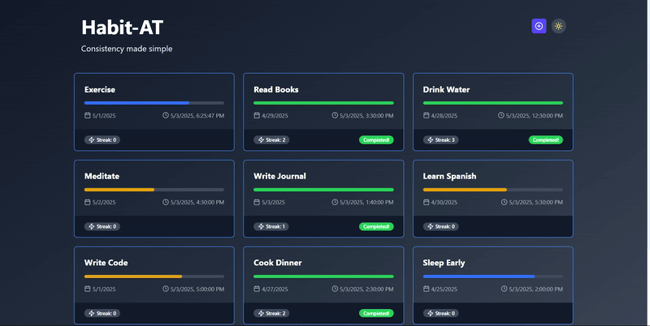

# 🧠 Habit-at — Habit Tracker SPA

**Habit-at** is a minimal, responsive, single-page application (SPA) built using **React**, **TypeScript**, and **Framer Motion**. Track your daily progress, monitor habit streaks, and stay motivated to build better routines.

## 🖼️ Demo

Here's a snapshot of the Habit-at Dashboard:



---

## 🚀 Features

* ✅ Create and manage daily habits
* 📈 Track progress with charts
* 🔔 Set reminders
* 🌙 Light/Dark mode support
* ⚡ Smooth transitions using Framer Motion

---

## 🛠️ Tech Stack

* **React + TypeScript**
* **Framer Motion**
* **Tailwind CSS**
* **React Router**
* **React Hot Toast**

---

## 🧹 Installation & Setup

Clone the repository:

```bash
git clone https://github.com/NematSiddique/Habit-At.git
cd habit-at
```

Install dependencies:

```bash
npm install
```

Start the development server:

```bash
npm run dev
```

Your app should now be running at `http://localhost:5173` (or the port specified by your setup).

---

## 📌 Notes

* This project is client-side only and does not use a backend.
* Mock data and reminders are handled with local state and simulated APIs.

---

## 💡 Future Enhancements

* Add user authentication
* Backend support with database
* Calendar view of habit logs
* Mobile-first push notifications

